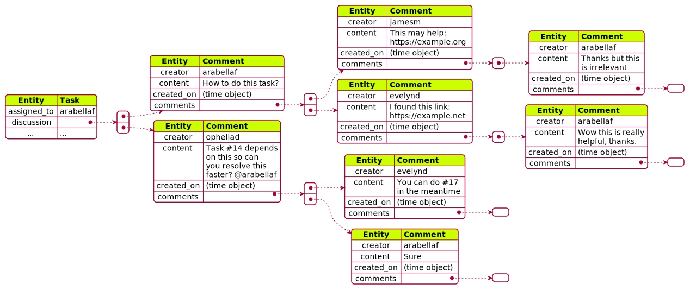

Data Tables
===========

From the relationship between data tables we analyzed above,
we derive three data tables: ``users``, ``projects``, ``files``.

The ``User`` entity set is mapped to ``users`` table.
Likewise, ``File`` is mapped to ``files`` table.

.. figure:: images/student.svg
   :figwidth: 100%

   An example database row for student. [1]_

.. figure:: images/file.svg
   :figwidth: 100%

   The structure of database table ``file``. [1]_

However, most other entities are stored within a single table ``projects``,
forming a typical tree-like structure of document-oriented database.
For example, two entities ``Artifact``\s storing revisions for report and slides
are included within a table row.
``Task``\s are stored in an array in the project.
.. TODO write about secondary index here and delete what Phong wrote

.. figure:: images/project.svg
   :figwidth: 100%

   The structure of database table ``projects``. [1]_

Within each task is a discussion thread with a forest structure of ``Comment``
entities.  There are several root comments within the discussions,
each can contain some child comments.

   The forest structure of ``discussion`` field. [1]_

.. [1] The JSON structure is visualized by PlantUML.
   Source text used can be found at https://github.com/Huy-Ngo/acanban/tree/main/docs/source/meth/database/tables/images
