Results and Discussion
======================

Results
-------

We have successfully implemented some of the use cases:

- Authentication
- Create and edit group projects
- Invite new members to a project
- Upload reports and slides
- Supervisors can evaluate students' work

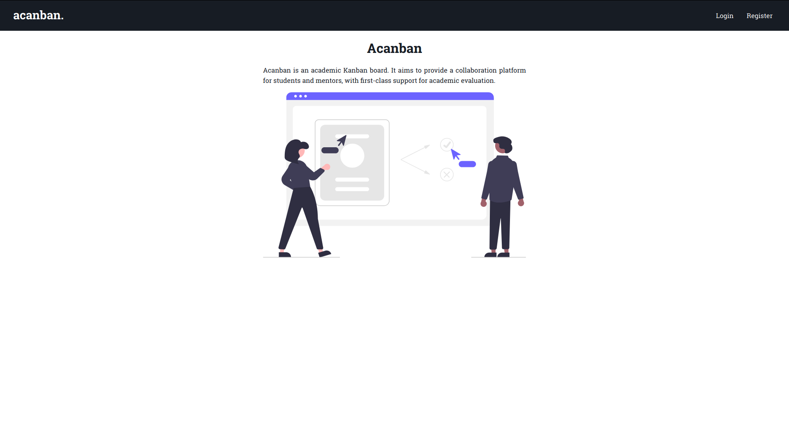
   
   The home page when the user is not logged in

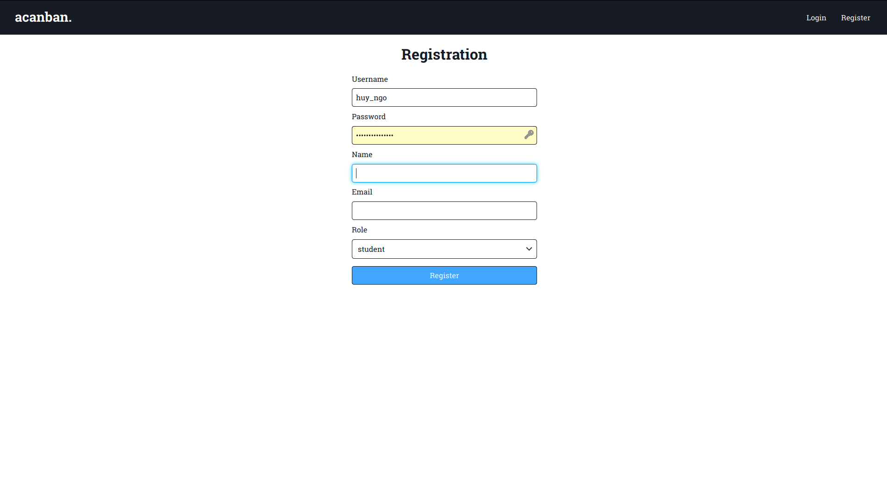

  The registration page

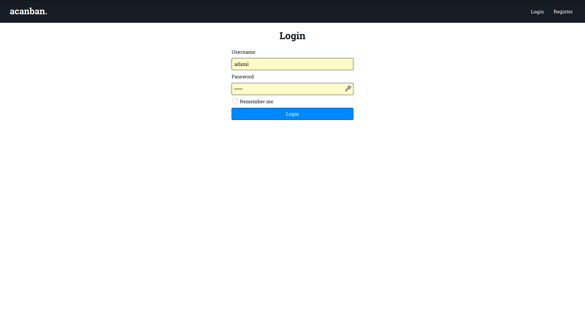

  The login page

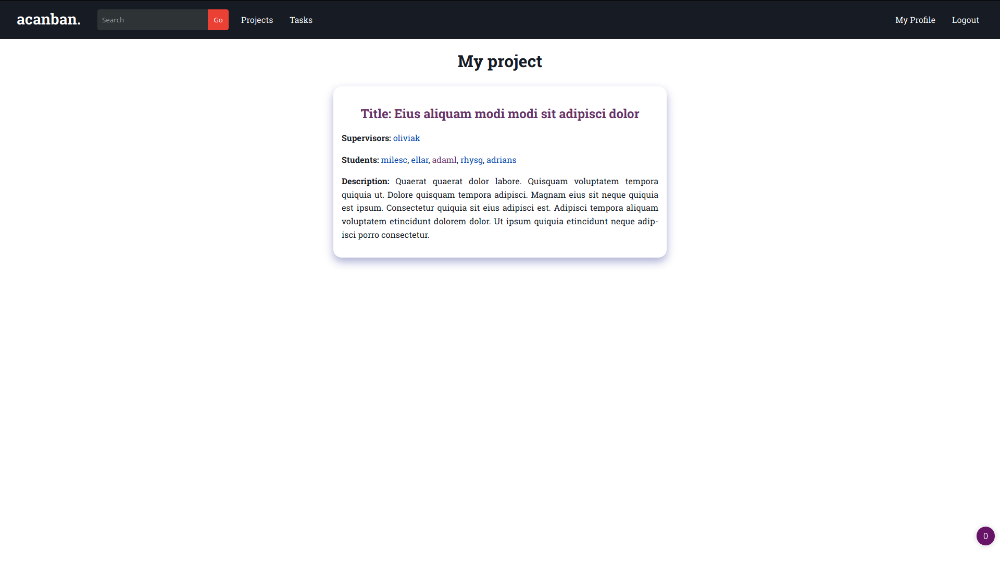

  The home page when the user is logged in

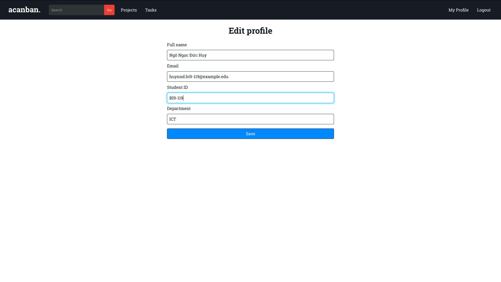

  The profile edit page

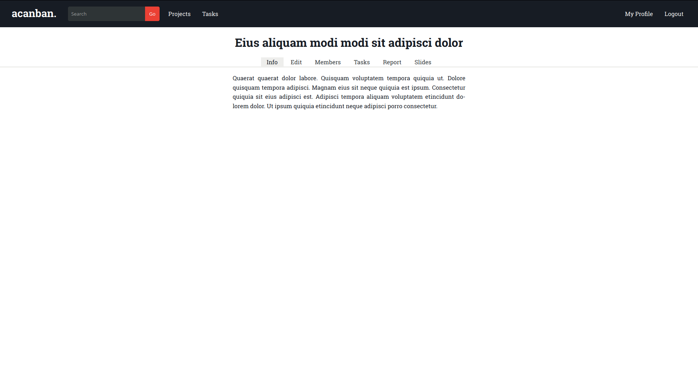

  The info page for a project

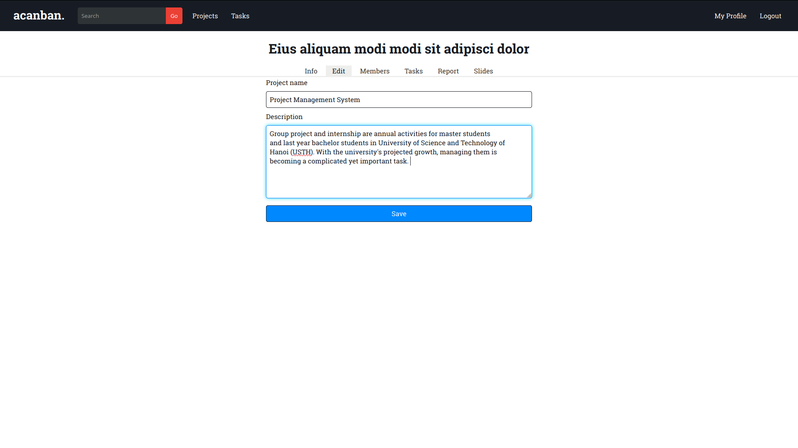

  Editing a project's information

.. figure:: screenshots/new-project.png

  Creating a new project

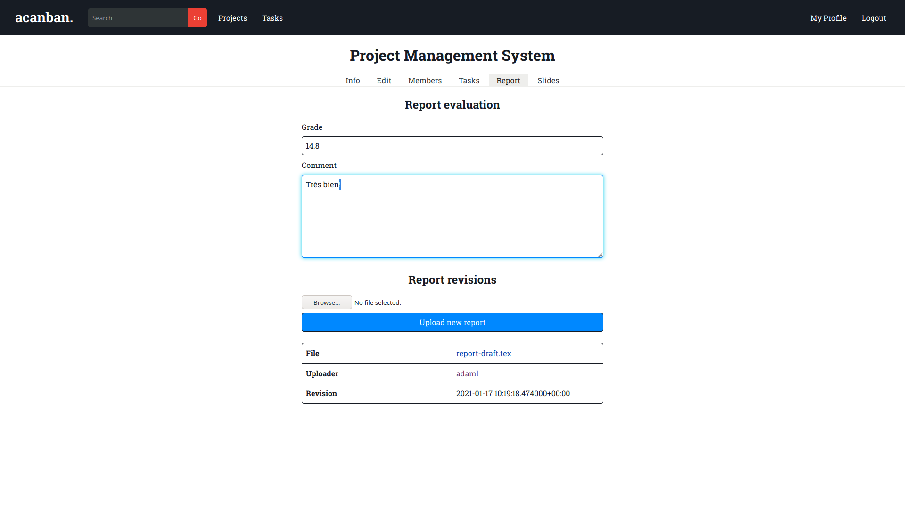

  Viewing and uploading project report

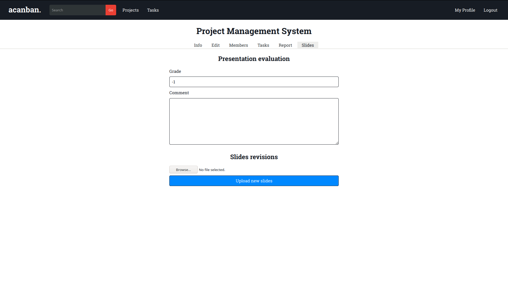

  Viewing and uploading presentation slides

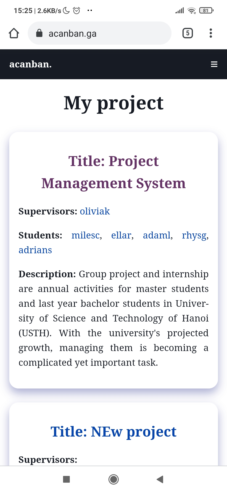

  Home page is responsively designed for mobile

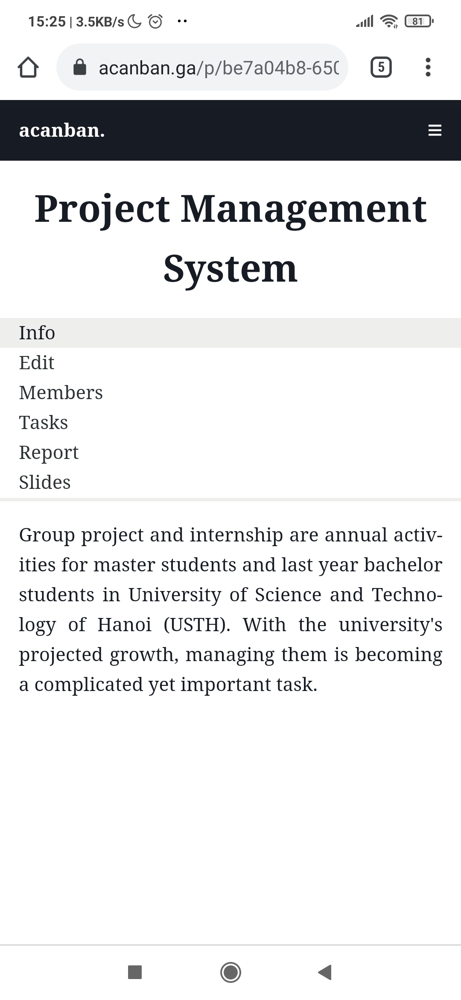

  Responsive design for project view

Discussion
----------

All of these use cases have been implemented in a simplistic manner,
which satisfied our goal of accessibility from all devices.

Nonetheless, there are numerous flaws that we have found in our system:

- Important features that have not been implemented:
  - notification
  - Create, view, and complete tasks on a simple Kanban board
  - discussion
  - jury's evaluation of reports and presentation
  - statistical reports for academic assistant
- Registration currently allows anyone to have as many accounts as they want,
  which is not secure.
- There hasn't been checking for maximum grade and minimum grade fraction.
- File types for reports and slides are not ensured yet.
- The user interface is not very attractive.
